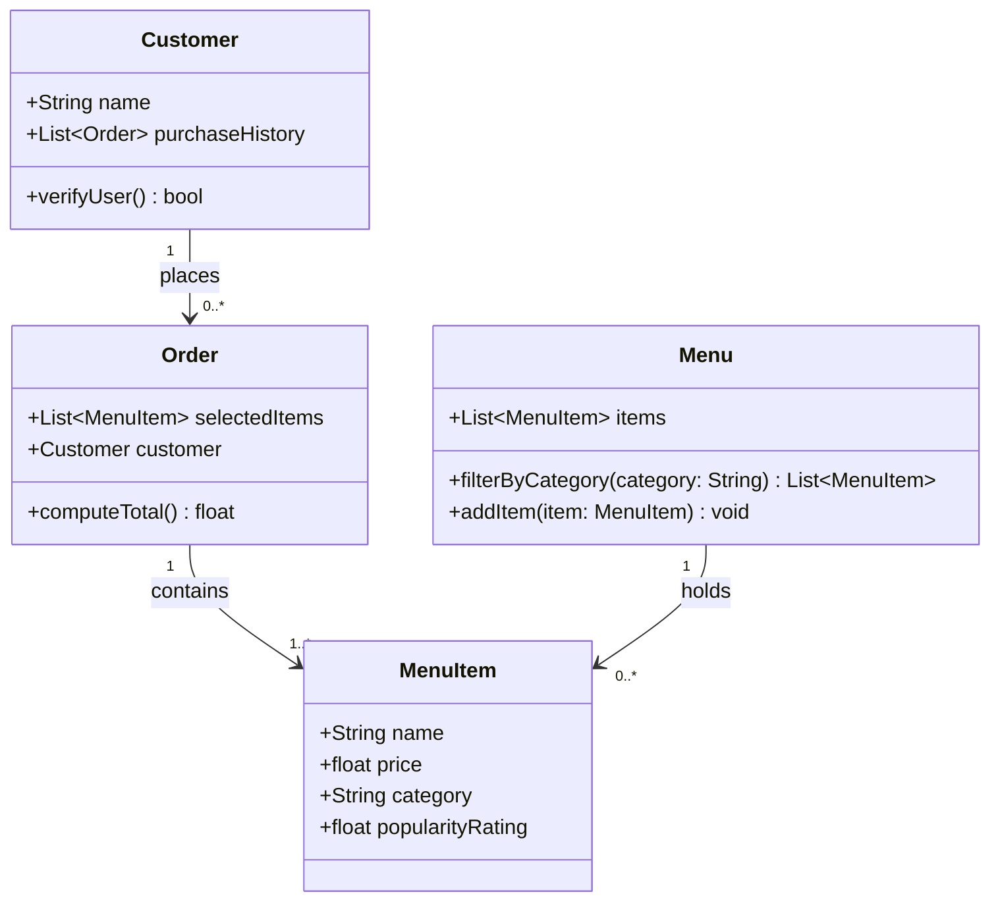

# ByteBites Final UML Design

Final class diagram verified against `bytebites_spec.md`.

## Comparison: Draft vs Final

| Aspect | Draft (`draft_from_copilot.md`) | Final (this file) |
|---|---|---|
| Classes | 4 | 4 (unchanged) |
| Attributes | Matched spec | Matched spec |
| Relationships | Customer→Order, Order→MenuItem, Menu→MenuItem | Same — no changes needed |
| Extra complexity | None | None |

The custom agent kept the design strictly within the four candidate classes and matched all attributes described in the feature request. No unnecessary classes or relationships were added.
