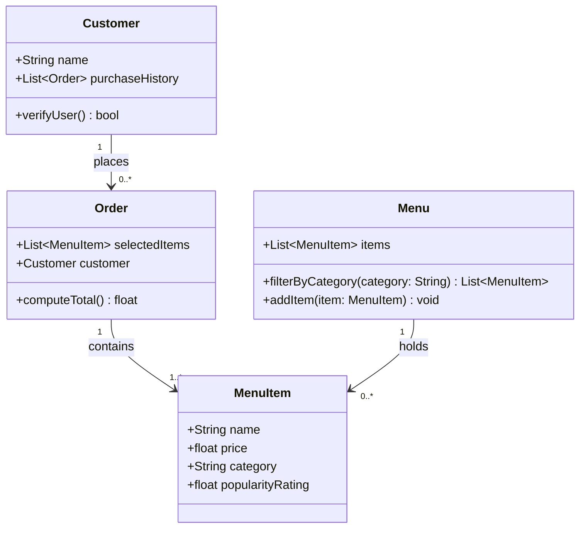

# Draft UML Class Diagram

Generated from `bytebites_spec.md` candidate classes.

## Review Notes

- All 4 classes match the candidate list (Customer, MenuItem, Menu, Order)
- Attributes align with the feature request descriptions
- No unexpected classes added
- Relationships are consistent with the spec
